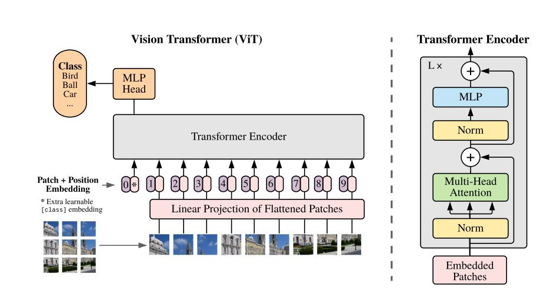
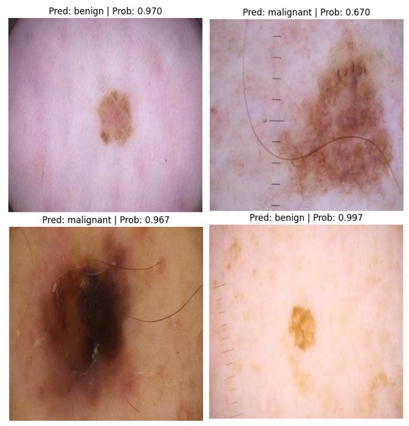

# 🧠 Melanoma Classification using Vision Transformer (ViT)

<p align="center">
  
</p>

## 📌 Overview

This project applies **Vision Transformer (ViT)** for the **classification of melanoma skin cancer images**, leveraging **transfer learning**. The model architecture and parameters follow the official implementation described in the paper:  
📄 [An Image is Worth 16x16 Words: Transformers for Image Recognition at Scale](https://arxiv.org/pdf/2010.11929)

## 📂 Dataset

The dataset used in this project is publicly available on Kaggle:  
🔗 [Melanoma Skin Cancer Dataset of 10,000 Images](https://www.kaggle.com/datasets/hasnainjaved/melanoma-skin-cancer-dataset-of-10000-images)

It includes labeled images for different skin lesion types including melanoma.

## ⚙️ Key Features

- ✅ Pretrained ViT model via transfer learning  
- ✅ Patch embedding and positional encoding  
- ✅ Fine-tuning MLP head for classification  
- ✅ Training with the same hyperparameters as in the original ViT paper

## 🚀 How to Use

1. Clone the repo:
   ```bash
   git clone https://github.com/EkramCh/melanoma-vit-classification.git
   cd melanoma-vit-classification
   ```

2. Download the dataset from Kaggle and place it in the `data/` directory.

3. train using the notebook.
4. Output
   <p align="center">
  
</p>
